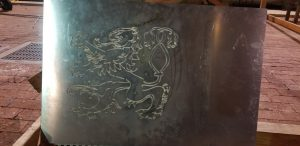
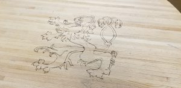
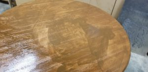
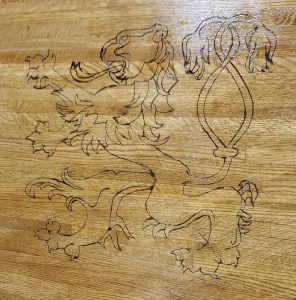

This was a fun project that was supposed to take approximately a weekend. It did take a weekend, three months after it was started.

Yet another project of the Blacker lion, this time I modified the .svg file in several image editors, mainly using Gimp and Inkscape to manually slice lines until there was a water-jettable version of the lion. The first time I tested it on the laser cutter, I had missed an important piece along the lion's tail. At last, I managed to get a .dxf that could be sent to the waterjet. As it turns out, the shop waterjet is old and the wrong version of the .dxf will take ages to load and generate far too many additional circles (read: every line becomes a semicircle with a ridiculous radius). Finally, I converted the .dxf to an older version (R12) to upload, and an old piece of scrap metal soon had a sick shadow!

The initial goal was to try woodburning with a propane torch directly onto the bare wood table, sanded some months earlier.

After several tests, however, it became clear that the propane torch would simply scorch anywhere near its flame and cause the metal to warp. We realized our options were to a) glue the metal onto the wood remove (?somehow) after heating, b) nail it directly into the newly sanded table, or c) give up and woodburn the table by hand.

I elected to do the woodburning, and a quick trip to the Michael's near campus and four hours later, I had burned the image into the table. We were able to use the stencil to trace with pencil, but a decent portion of this was freehand.

My sister was in town that weekend, and she helped with the three finishing coats on the final product.

The stain was very dark and we were worried about the absorption, but the final product turned out alright!

