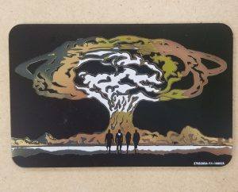

Yet another Blacker-related image processing project! I took a picture of the lounge mural and reduced it to 4 colors, editing individual pieces by hand to produce this "cannon card," given to students when they first joined the house.

